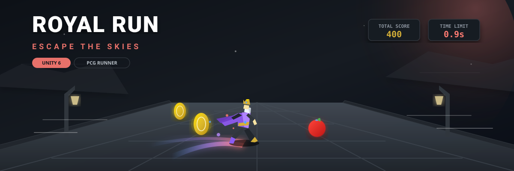

# 👑 Royal Run: Escape the Skies



**Royal Run: Escape the Skies** is an action-packed, fast-paced 3D endless runner game developed as a personal project in **Unity 6**. Take control of the King as he sprints across floating procedural stone bridges high in the clouds, dodging ancient obstacles, collecting treasures, and escaping the collapsing sky!

---

## 🎮 Game Preview

Here is a look at the gameplay, main menu, and game over screens:

| 🖥️ Main Menu | 🏃 Gameplay | 💀 Game Over |
| :---: | :---: | :---: |
|  |  |  |

---

## 🚀 Key Features & Development Highlights

### 1. Procedural Content Generation (PCG) Chunks
The game utilizes an advanced procedural placement algorithm to generate an infinite running path. 
* **Dynamic Spawning:** Chunks are spawned dynamically ahead of the player and destroyed behind them to optimize memory. Check out [LevelGenerator.cs](file:///c:/Users/tejas/Downloads/Royal_Run-Game-Unity-Engine-6/Assets/Scripts/Pcg/LevelGenerator.cs) and [Chunks.cs](file:///c:/Users/tejas/Downloads/Royal_Run-Game-Unity-Engine-6/Assets/Scripts/Pcg/Chunks.cs).
* **Checkpoint System:** A special Checkpoint Chunk spawns at fixed intervals, extending the player's time limit. See [CheckPoint.cs](file:///c:/Users/tejas/Downloads/Royal_Run-Game-Unity-Engine-6/Assets/Scripts/Pcg/CheckPoint.cs).

### 2. Character & Environment Animations
* Implemented smooth transitions between running, turning, collecting, and obstacle collision states.
* Configured Unity's **Animator Controller** with blend trees to ensure responsive, lag-free character behavior reflecting the game's high speed.

### 3. Atmospheric Environment & Cinematic Color Grading
* Set up a stylized medieval bridge in a skybox environment.
* Configured **Unity URP (Universal Render Pipeline)** Post-Processing features:
  * **Color Grading:** Warm shadows and vibrant cinematic highlights.
  * **Bloom & Vignette:** Highlighting glowing magic items and emphasizing the fast running tunnel vision.
  * **Volumetric Fog:** Adding depth and altitude presence.

### 4. Core Gameplay Programming
* **Responsive Controls:** Implemented using Unity's new Input System for precise horizontal movement. See [PlayerController.cs](file:///c:/Users/tejas/Downloads/Royal_Run-Game-Unity-Engine-6/Assets/Scripts/Player/PlayerController.cs).
* **Collision Logic:** Robust obstacle detection that triggers game-over states and camera shakes. See [PlayerCollisionhandler.cs](file:///c:/Users/tejas/Downloads/Royal_Run-Game-Unity-Engine-6/Assets/Scripts/Player/PlayerCollisionhandler.cs).

### 5. Immersive Soundscapes & Music
* Integrated background music to maintain high-energy gameplay.
* Created a modular [SoundObject.cs](file:///c:/Users/tejas/Downloads/Royal_Run-Game-Unity-Engine-6/Assets/Scripts/SoundObject.cs) to play dynamic 3D sound effects at the exact spatial point of collection or collision.

### 6. Gamified User Interface (UI)
* **Main Menu:** Premium retro-stylized menu with Play, Quit, and Info overlays. See [MainMenu.cs](file:///c:/Users/tejas/Downloads/Royal_Run-Game-Unity-Engine-6/Assets/Scripts/MainMenu.cs).
* **HUD:** Real-time scoring and a counting-down timer that increases when hitting checkpoints.
* **Game Over Screen:** Blurs the gameplay view and brings up interactive restart buttons. See [GameManager.cs](file:///c:/Users/tejas/Downloads/Royal_Run-Game-Unity-Engine-6/Assets/Scripts/manager/GameManager.cs).

### 7. Interactive Collectibles (Coins & Apples)
* **Gold Coins:** Increases score by fixed amounts. See [Coin.cs](file:///c:/Users/tejas/Downloads/Royal_Run-Game-Unity-Engine-6/Assets/Scripts/Pickups/Coin.cs).
* **Apples:** Acts as a speed modifier, boosting run speed and updating the camera FOV dynamically for a heightened sense of velocity. See [Apple.cs](file:///c:/Users/tejas/Downloads/Royal_Run-Game-Unity-Engine-6/Assets/Scripts/Pickups/Apple.cs).

### 8. Niagara Particles & Visual Effects (VFX)
* Added magical visual feedback using Unity 6's advanced VFX Graph / particle systems.
* Sparks fly when collecting gold, green magic trails emit upon eating speed apples, and dust clouds puff from the King's boots as he sprints across the ancient stones.

---

## 🛠️ Installation & Setup

1. **Clone the repository:**
   ```bash
   git clone https://github.com/Shoubhik95/Royal_Run-Game-Unity-Engine-6.git
   ```
2. **Open in Unity:**
   * Open **Unity Hub**.
   * Click **Add** and choose the cloned repository folder.
   * Ensure you are using **Unity 6** or higher to prevent rendering pipeline conflicts.
3. **Play the Game:**
   * Open the scene located at `Assets/Scenes/MainMenu.unity`.
   * Press **Play**!
